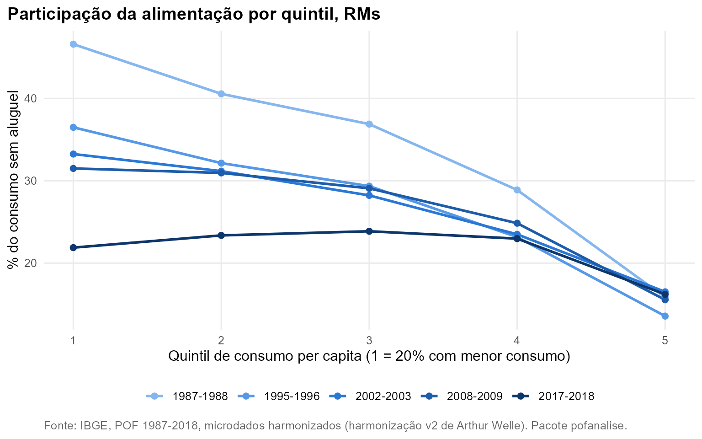
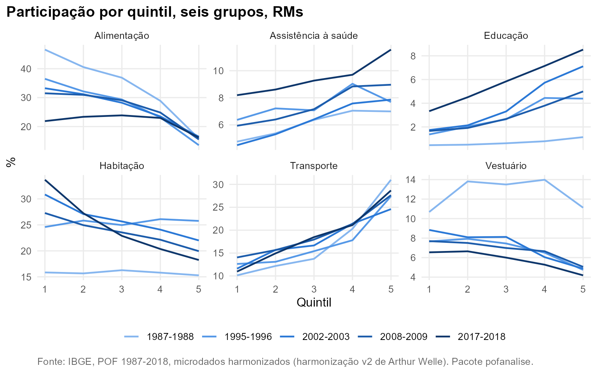

# Quintis e curvas de Engel

**Pergunta.** Como o peso de cada grupo varia entre famílias com
diferentes níveis de consumo, e a Lei de Engel (a participação da
alimentação cai quando o orçamento cresce) continua valendo?

**Método.** Quintis de despesa de consumo per capita, ponderados por
pessoa e calculados dentro de cada edição
([`pof_add_quintis()`](https://talesalonso1996-ops.github.io/pofanalise/reference/pof_add_quintis.md));
a renda não está harmonizada entre edições. Conjunto das RMs, consumo
sem aluguel. Elasticidade-despesa pela especificação de Working-Leser
([`pof_engel()`](https://talesalonso1996-ops.github.io/pofanalise/reference/pof_engel.md)).

## A curva de Engel achatou

Em 1987-1988 a alimentação pesava 46,6% do consumo do 1º quintil e 15,8%
do 5º. Em 2017-2018, 21,9% e 16,2%. Entre o 1º e o 4º quintil a curva
ficou quase plana: a diferença caiu de 17,7 para -1,1 pontos
percentuais. A elasticidade-despesa da alimentação sobe de 0,72 para
0,94.



## Da comida para a moradia

A razão entre a participação no 1º e no 5º quintil resume a inclinação:
acima de 1, o grupo pesa mais para quem consome menos. Na alimentação a
razão cai de 2,94 para 1,35. Na habitação sem aluguel (energia, água,
gás, telefonia, manutenção), ela sobe de 1,04 para 1,85. No orçamento
das famílias com menor consumo, o peso relativo se deslocou da comida
para os serviços da moradia.



## Elasticidades

| Grupo                       | 1987-1988 | 1995-1996 | 2002-2003 | 2008-2009 | 2017-2018 |
|:----------------------------|----------:|----------:|----------:|----------:|----------:|
| Alimentação                 |      0,72 |      0,77 |      0,81 |      0,83 |      0,94 |
| Assistência à saúde         |      1,07 |      1,00 |      1,17 |      1,08 |      1,07 |
| Despesas diversas           |      1,59 |      1,44 |      1,64 |      1,58 |      1,51 |
| Educação                    |      1,41 |      1,43 |      1,57 |      1,54 |      1,45 |
| Habitação                   |      0,94 |      0,98 |      0,84 |      0,84 |      0,71 |
| Higiene e cuidados pessoais |      0,96 |      0,92 |      0,91 |      0,90 |      0,64 |
| Recreação e cultura         |      1,19 |      1,22 |      1,30 |      1,14 |      1,11 |
| Serviços pessoais           |      0,70 |      0,71 |      0,77 |      0,80 |      0,82 |
| Transporte                  |      1,43 |      1,29 |      1,29 |      1,31 |      1,39 |
| Vestuário                   |      1,07 |      0,92 |      0,85 |      0,90 |      0,92 |

Elasticidade-despesa na média (Working-Leser), RMs. Abaixo de 1: bem
necessário.

## Reproduzir

``` r
bs <- pof_add_quintis(pof_sem_aluguel(b))
pof_participacao(bs, "Alimentação", por = "Quintil_RM", filtro = quote(!is.na(RGMT)))
pof_engel(bs[!is.na(RGMT)], pof_grupos_consumo())
```
