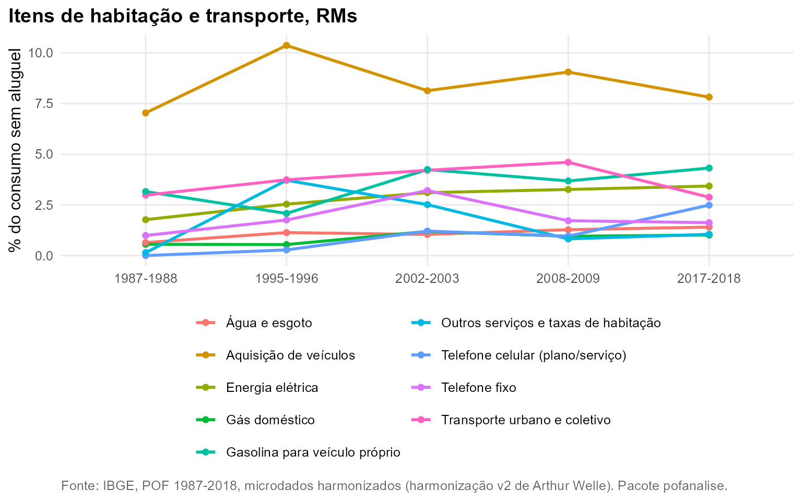
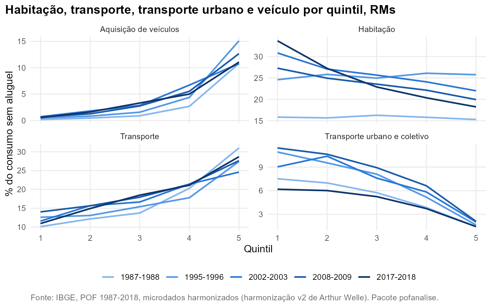

# Habitação e transporte

**Pergunta.** Como evoluíram os componentes de habitação e transporte, e
como pesam em famílias de diferentes níveis de consumo?

**Método.** Folhas da harmonização v2: aluguel (17101), energia (17102),
gás (17103), água e esgoto (17104), telefone fixo (17201), telefone
celular (17202), transporte urbano e coletivo (20101), gasolina (20201)
e aquisição de veículos (20301). Participação no consumo sem aluguel; o
aluguel é medido sobre o consumo completo. Conjunto das RMs.

## A quebra de série do aluguel

De 2002-2003 em diante, 98,5% a 99,6% das UCs metropolitanas têm aluguel
registrado, o que só é possível com o aluguel estimado de quem mora em
imóvel próprio; o item pesa 20,8% do consumo em 2017-2018. Em 1995-1996
só 18,3% das UCs têm aluguel (inquilinos). Em 1987-1988 o registro
existe para 99,6%, mas pesa só 3,8% do consumo. Por isso as comparações
entre as cinco edições excluem o aluguel
([`pof_sem_aluguel()`](https://talesalonso1996-ops.github.io/pofanalise/reference/pof_sem_aluguel.md)).

## Itens da moradia e do transporte

O telefone celular (serviço) passa de 1,2% do consumo sem aluguel em
2002-2003 para 2,5% em 2017-2018, enquanto o telefone fixo cai de 3,2%
para 1,6%. O transporte urbano e coletivo cai de 4,6% em 2008-2009 para
2,9%, e a proporção de UCs com esse gasto, de 65,9% para 49,8%.



## Por quintil

O transporte urbano pesa 6,2% no consumo do 1º quintil e 1,4% no do 5º
em 2017-2018; a compra de veículo faz o caminho inverso (0,6% contra
11,1%). Habitação sem aluguel pesa 33,7% no 1º quintil e 18,2% no 5º,
distância que não existia em 1987-1988 (15,8% e 15,3%).



## Reproduzir

``` r
dados <- pof_carregar(dir = dir, itens = list(onibus = "20101", veiculo = "20301"))
pof_analisar(dados, "onibus", medida = "prevalencia")
plot(pof_analisar(dados, "onibus", medida = "participacao", por = "quintil"))
```
