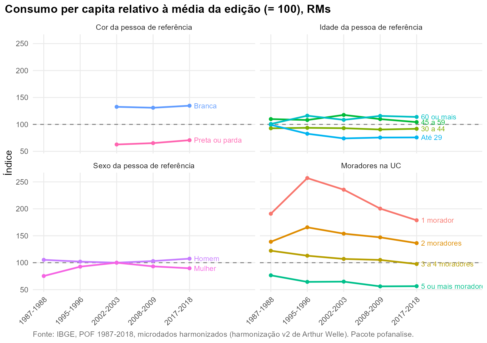

# Perfil da unidade de consumo

**Pergunta.** Como o nível e a composição do consumo variam com o sexo,
a idade e a cor da pessoa de referência e com o tamanho da UC?

**Método.** Consumo per capita (sem aluguel) de cada grupo como índice
da média da edição (média = 100), o que dispensa deflacionamento.
Conjunto das RMs. A cor não existe em 1987 e não tem as categorias
usadas em 1995; a análise por cor começa em 2002.

## As UCs mudaram

A proporção de UCs com mulher como pessoa de referência passa de 21,0%
para 44,2%. As UCs com cinco ou mais moradores caem de 35,3% para 11,3%,
e as com pessoa de referência de 60 anos ou mais sobem de 15,9% para
28,2%. Parte da mudança na estrutura do orçamento vem dessa
recomposição.

## Nível de consumo relativo

Em 2017-2018 o consumo per capita das UCs com pessoa de referência
branca é 134,7% da média; o das UCs com pessoa de referência preta ou
parda, 70,7%. Em 2002-2003 eram 132,6 e 62,7. UCs de uma pessoa consomem
178,8% da média per capita, e as de cinco ou mais, 56,4%; parte disso
são economias de escala que a medida per capita não ajusta.



## Composição

A alimentação pesa 21,4% do consumo das UCs com pessoa de referência
preta ou parda e 17,9% das com pessoa de referência branca. Nas UCs com
pessoa de referência de 60 anos ou mais, a saúde chega a 16,8%.

| Dimensao | Categoria | Alimentação | Assistência à saúde | Educação | Habitação | Transporte |
|:---|:---|:---|:---|:---|:---|:---|
| Cor da pessoa de referência | Branca | 17,9 | 11,2 | 8,2 | 20,5 | 25,3 |
| Cor da pessoa de referência | Preta ou parda | 21,4 | 9,5 | 6,1 | 20,3 | 22,7 |
| Idade da pessoa de referência | 30 a 44 | 19,1 | 7,1 | 9,0 | 18,8 | 26,7 |
| Idade da pessoa de referência | 45 a 59 | 19,2 | 9,8 | 9,2 | 20,0 | 24,6 |
| Idade da pessoa de referência | 60 ou mais | 18,7 | 16,8 | 3,6 | 23,2 | 21,2 |
| Idade da pessoa de referência | Até 29 | 22,9 | 5,2 | 5,9 | 19,6 | 23,3 |
| Moradores na UC | 1 morador | 21,1 | 11,9 | 3,4 | 23,4 | 23,1 |
| Moradores na UC | 2 moradores | 19,3 | 13,0 | 4,1 | 22,3 | 23,0 |
| Moradores na UC | 3 a 4 moradores | 18,6 | 9,5 | 9,3 | 19,6 | 25,4 |
| Moradores na UC | 5 ou mais moradores | 20,5 | 9,0 | 9,4 | 18,2 | 22,6 |
| Sexo da pessoa de referência | Homem | 18,9 | 10,2 | 8,0 | 19,3 | 25,9 |
| Sexo da pessoa de referência | Mulher | 19,8 | 11,1 | 6,5 | 22,3 | 21,5 |

Participação no consumo sem aluguel segundo o perfil, RMs, 2017-2018 (%)

## Reproduzir

``` r
dados <- pof_carregar(dir = dir)
pof_analisar(dados, "Alimentação", medida = "participacao", por = "cor")
pof_modelo(dados[3:5], "Educação", ~ quintil + cor + sexo + idade)
```
