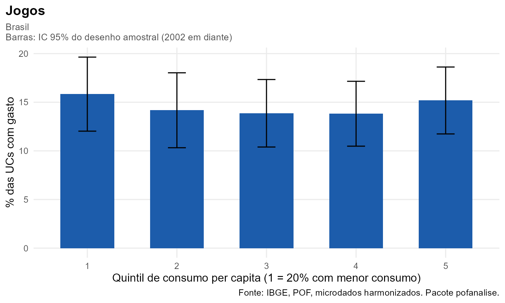

# Guia de pesquisa

Este guia mostra como investigar **qualquer item de despesa** da POF nas
cinco edições com quatro funções. Você informa o item, a medida e o
corte; o pacote cuida do recorte comparável, do aluguel, dos quintis, do
desenho amostral e do gráfico.

| Passo | Função | Você informa |
|----|----|----|
| 1\. Achar o código | [`pof_buscar()`](https://talesalonso1996-ops.github.io/pofanalise/reference/pof_buscar.md) | um termo, como `"celular"` |
| 2\. Carregar | [`pof_carregar()`](https://talesalonso1996-ops.github.io/pofanalise/reference/pof_carregar.md) | edições e itens |
| 3\. Descrever | [`pof_analisar()`](https://talesalonso1996-ops.github.io/pofanalise/reference/pof_analisar.md) + [`plot()`](https://rdrr.io/r/graphics/plot.default.html) | medida e corte |
| 4\. Comparar e modelar | [`pof_diferenca()`](https://talesalonso1996-ops.github.io/pofanalise/reference/pof_diferenca.md), [`pof_modelo()`](https://talesalonso1996-ops.github.io/pofanalise/reference/pof_modelo.md) | grupos ou fórmula |
| 5\. Ir além | [`pof_variacao()`](https://talesalonso1996-ops.github.io/pofanalise/reference/pof_variacao.md), [`pof_concentracao()`](https://talesalonso1996-ops.github.io/pofanalise/reference/pof_concentracao.md), [`pof_decompor()`](https://talesalonso1996-ops.github.io/pofanalise/reference/pof_decompor.md), [`pof_composicao()`](https://talesalonso1996-ops.github.io/pofanalise/reference/pof_composicao.md), [`pof_elasticidade()`](https://talesalonso1996-ops.github.io/pofanalise/reference/pof_elasticidade.md) | edições, item ou grupo |
| 6\. Publicar | [`pof_tabela()`](https://talesalonso1996-ops.github.io/pofanalise/reference/pof_tabela.md), [`pof_exportar()`](https://talesalonso1996-ops.github.io/pofanalise/reference/pof_exportar.md) | resultado e arquivo |

Os blocos com microdados mostram o código para copiar. Os resultados que
rodam nesta página usam
[`pof_exemplo()`](https://talesalonso1996-ops.github.io/pofanalise/reference/pof_exemplo.md),
uma base sintética no mesmo formato, com um item chamado `Jogos`.

## 1. Achar o código do item

[`pof_buscar()`](https://talesalonso1996-ops.github.io/pofanalise/reference/pof_buscar.md)
procura o termo nos nomes das categorias e nas descrições dos produtos
originais de cada edição, sem diferenciar acentos.

``` r
pof_buscar("aposta|loteria")
#>   codigo   nivel  nome                                                n1
#> 1  26101   folha  Jogos e apostas                                     26. Despesas diversas
#> 2  26101 produto  Jogos e apostas (DESPESAS COM JOGOS E APOSTAS)      26. Despesas diversas
#> 3  33202 produto  Outros rendimentos (GANHOS DE JOGOS ... OU PREMIOS) 33. Outros rendimentos
```

Um item pode ser uma folha (5 dígitos, `"26101"`), um Nível 2 (3
dígitos, `"172"`, telefonia e comunicações) ou um Nível 1 (2 dígitos,
`"22"`, assistência à saúde), ou uma combinação deles.

## 2. Carregar as edições com os itens

``` r
dados <- pof_carregar(
  anos  = c(1987, 1995, 2002, 2008, 2017),
  dir   = "HarmonizaPOF2026_data",
  itens = list(apostas  = "26101",
               celular  = c("17202", "24201"),   # serviço + aparelho
               refeicao = "16104",
               saude    = "22"))
```

Cada edição vira uma base por unidade de consumo com uma coluna para
cada item, os grandes grupos (`Alimentação`, `Habitação`…) e os cortes
prontos: `quintil`, `sexo`, `idade`, `cor`, `tamanho` e `rm`.

## 3. Descrever o item

[`pof_analisar()`](https://talesalonso1996-ops.github.io/pofanalise/reference/pof_analisar.md)
calcula a medida em cada edição, com IC de 95% quando há desenho
amostral (2002 em diante).

- `medida = "prevalencia"`: % de UCs com gasto no item.
- `medida = "participacao"`: % do item na despesa de consumo.
- `medida = "gasto_medio"`: gasto mensal médio por UC. Os valores são
  nominais; compare só dentro da edição.

``` r
b <- pof_exemplo()
r <- pof_analisar(b, "Jogos", medida = "prevalencia", por = "quintil")
r
#> Item: Jogos | % das UCs com gasto 
#> Recorte: Brasil  | por quintil 
#> 
#>     Edicao  Grupo Estimativa IC_inf IC_sup  N_UC
#>     <char> <char>      <num>  <num>  <num> <int>
#> 1: exemplo      1      11.61   8.25  14.98   381
#> 2: exemplo      2      17.56  13.63  21.49   401
#> 3: exemplo      3      11.91   8.62  15.21   420
#> 4: exemplo      4      10.94   7.65  14.22   397
#> 5: exemplo      5      13.80  10.38  17.22   401
plot(r)
```



**Escolhas automáticas.** Se houver 1987 ou 1995 entre as edições, o
recorte passa a ser o das regiões metropolitanas e o aluguel sai do
consumo, para que a comparação seja válida. As escolhas ficam
registradas no resultado (`attr(r, "escolhas")`) e no subtítulo do
gráfico. Para mudar: `recorte = "brasil"` e `sem_aluguel = FALSE`.

``` r
pof_analisar(dados, "apostas")                                   # série, RMs
pof_analisar(dados[3:5], "celular", medida = "participacao",
             por = "quintil")                                    # Brasil, 2002 em diante
plot(pof_analisar(dados, "refeicao", medida = "participacao", por = "quintil"))
```

## 4. Comparar grupos e modelar

[`pof_diferenca()`](https://talesalonso1996-ops.github.io/pofanalise/reference/pof_diferenca.md)
estima a diferença entre as categorias de um corte e uma categoria de
referência, com IC e p-valor, por regressão com o desenho amostral.

``` r
pof_diferenca(b, "Jogos", por = "sexo", referencia = "Mulher")
#>     Edicao  Grupo Referencia Diferenca    IC_inf   IC_sup    p_valor
#>     <char> <char>     <char>     <num>     <num>    <num>      <num>
#> 1: exemplo  Homem     Mulher  3.731821 0.5794399 6.884203 0.02043624
```

[`pof_modelo()`](https://talesalonso1996-ops.github.io/pofanalise/reference/pof_modelo.md)
ajusta um modelo logístico para a chance de ter gasto com o item
(`tipo = "prevalencia"`, resultados em razão de chances) ou um modelo
para o log do gasto entre quem gasta (`tipo = "gasto"`).

``` r
pof_modelo(b, "Jogos", ~ quintil + sexo + idade)
#>     Edicao           Termo Estimativa    IC_inf    IC_sup      p_valor  N_UC
#>     <char>          <char>      <num>     <num>     <num>        <num> <int>
#> 1: exemplo     (Intercept)  0.1985342 0.1309907 0.3009058 1.346887e-13  2000
#> 2: exemplo        quintil2  1.5851541 1.0474719 2.3988364 2.938681e-02  2000
#> 3: exemplo        quintil3  1.0122452 0.6295852 1.6274849 9.598486e-01  2000
#> 4: exemplo        quintil4  0.9032307 0.5589458 1.4595793 6.770354e-01  2000
#> 5: exemplo        quintil5  1.1959656 0.7682834 1.8617267 4.271995e-01  2000
#> 6: exemplo      sexoMulher  0.7360060 0.5580148 0.9707714 3.008960e-02  2000
#> 7: exemplo    idade45 a 59  0.7000581 0.4834532 1.0137101 5.900334e-02  2000
#> 8: exemplo idade60 ou mais  0.7063891 0.4970014 1.0039922 5.264188e-02  2000
#> 9: exemplo     idadeAté 29  0.7751603 0.5077390 1.1834300 2.374313e-01  2000
```

Com os microdados de 2017-2018, por exemplo,
`pof_modelo(dados["2017-2018"], "apostas", ~ quintil + sexo + cor)`
estima a chance de gasto com jogos e apostas por quintil, sexo e cor da
pessoa de referência, controlando as demais.

## 5. Ferramentas para ir além

### A mudança é significativa?

[`pof_variacao()`](https://talesalonso1996-ops.github.io/pofanalise/reference/pof_variacao.md)
compara duas edições de um resultado, grupo a grupo, com IC e p-valor.
Como as amostras de edições diferentes são independentes, o erro-padrão
da diferença combina os dois.

``` r
a <- pof_exemplo(semente = 1); a$Edicao <- "2008-2009"
d <- pof_exemplo(semente = 2); d$Edicao <- "2017-2018"
dois <- list(a, d)
r <- pof_analisar(dois, "Jogos", por = "sexo")
pof_variacao(r, de = "2008-2009", para = "2017-2018")
#> Key: <Grupo>
#>     Grupo       De     Para Diferenca    IC_inf   IC_sup   p_valor
#>    <char>    <num>    <num>     <num>     <num>    <num>     <num>
#> 1:  Homem 15.06624 17.36731  2.301072 -1.147866 5.750010 0.1909825
#> 2: Mulher 11.33442 12.67217  1.337755 -1.638731 4.314241 0.3783694
#>    Significativa
#>           <lgcl>
#> 1:         FALSE
#> 2:         FALSE
```

### O gasto é progressivo ou regressivo?

[`pof_concentracao()`](https://talesalonso1996-ops.github.io/pofanalise/reference/pof_concentracao.md)
ordena as pessoas pelo consumo per capita e mede como o gasto com o item
se distribui. O índice `K` compara a concentração do item com a do
consumo: negativo, o item pesa mais no orçamento de quem consome menos;
positivo, de quem consome mais. `Base40` e `Topo20` dizem quanto do
gasto total vem dos 40% com menor consumo e dos 20% com maior consumo.

``` r
pof_concentracao(b, c("Alimentação", "Educação", "Transporte"))
#>     Edicao        Item         C Gini_consumo           K   Base40   Topo20
#>     <char>      <char>     <num>        <num>       <num>    <num>    <num>
#> 1: exemplo Alimentação 0.3907426    0.4193562 -0.02861368 16.89240 45.91807
#> 2: exemplo    Educação 0.4675087    0.4193562  0.04815243 12.78821 51.66186
#> 3: exemplo  Transporte 0.4325340    0.4193562  0.01317775 14.15685 48.60857
#>    Classificacao
#>           <char>
#> 1:    Regressivo
#> 2:   Progressivo
#> 3:   Progressivo
```

### Comportamento ou composição?

Uma participação pode mudar porque as famílias mudaram o que compram ou
porque mudou o tipo de família (mais idosos, mais gente morando
sozinha).
[`pof_decompor()`](https://talesalonso1996-ops.github.io/pofanalise/reference/pof_decompor.md)
separa os dois efeitos; a soma é exatamente a variação total.

``` r
dc <- pof_decompor(dois, "Alimentação", por = "tamanho", de = "2008-2009", para = "2017-2018")
dc$resumo
#>           Item     Por        De      Para Participacao_de Participacao_para
#>         <char>  <char>    <char>    <char>           <num>             <num>
#> 1: Alimentação tamanho 2008-2009 2017-2018        25.38023          25.40596
#>    Variacao_total Efeito_comportamento Efeito_composicao
#>             <num>                <num>             <num>
#> 1:     0.02572938           0.07012173       -0.04439236
dc$grupos
#> Key: <Grupo>
#>                  Grupo   Peso_de Peso_para  Part_de Part_para Comportamento
#>                 <char>     <num>     <num>    <num>     <num>         <num>
#> 1:           1 morador  5.592231  4.796146 29.69339  30.46992   0.040334589
#> 2:         2 moradores  8.966169  9.659177 27.09766  26.75237  -0.032156124
#> 3:     3 a 4 moradores 33.816076 31.379199 25.29407  25.45637   0.052905876
#> 4: 5 ou mais moradores 51.625524 54.165478 24.67118  24.68826   0.009037392
#>    Composicao
#>         <num>
#> 1: -0.2394757
#> 2:  0.1865924
#> 3: -0.6183628
#> 4:  0.6268537
```

### Do que é feito um grupo?

[`pof_composicao()`](https://talesalonso1996-ops.github.io/pofanalise/reference/pof_composicao.md)
abre um grupo nas suas partes: um grande grupo (`"Alimentação"`) nas
categorias de Nível 1, ou um Nível 1 não alimentar (`"22"`, saúde) nas
folhas.

``` r
pof_composicao(dados, "22")              # remédios, plano, consultas...
pof_composicao(dados, "Alimentação", por = "quintil")
```

### Elasticidade de qualquer item

``` r
pof_elasticidade(b, "Alimentação", por = "sexo")[, .(Grupo, elasticidade = round(elasticidade, 2), N)]
#>     Grupo elasticidade     N
#>    <char>        <num> <int>
#> 1: Mulher         0.91  1029
#> 2:  Homem         0.91   971
```

### Levar para o artigo

[`pof_tabela()`](https://talesalonso1996-ops.github.io/pofanalise/reference/pof_tabela.md)
monta a tabela larga (grupos nas linhas, edições nas colunas, IC entre
colchetes) e
[`pof_exportar()`](https://talesalonso1996-ops.github.io/pofanalise/reference/pof_exportar.md)
grava em CSV que o Excel em português abre direto.

``` r
pof_tabela(pof_analisar(dois, "Jogos", por = "quintil"))
#> Key: <Grupo>
#>     Grupo         2008-2009         2017-2018
#>    <char>            <char>            <char>
#> 1:      1  11,6 [8,2; 15,0] 14,9 [11,3; 18,6]
#> 2:      2 17,6 [13,6; 21,5]  11,7 [8,5; 14,9]
#> 3:      3  11,9 [8,6; 15,2] 16,0 [12,2; 19,9]
#> 4:      4  10,9 [7,7; 14,2] 16,1 [12,3; 20,0]
#> 5:      5 13,8 [10,4; 17,2] 15,8 [12,1; 19,6]
```

``` r
pof_exportar(pof_tabela(r), "apostas_por_sexo.csv")
```

## Cuidados

- **Comparar edições.** Use o recorte das RMs com consumo sem aluguel (o
  padrão quando há 1987 ou 1995).
- **Itens raros.** Em recortes pequenos (uma RM, um quintil) o IC fica
  largo; confira `N_UC` e a largura do intervalo antes de interpretar
  diferenças.
- **Qualidade da harmonização.** Confira a nota da folha em
  `pof_harmonizacao()$folhas` ou no
  [explorador](https://arthurwelle.github.io/Harmoniza_Produtos/).
  Folhas com qualidade média ou baixa podem estar ausentes em alguma
  edição.
- **1987 e 1995** não têm desenho amostral: as estimativas saem sem IC.
