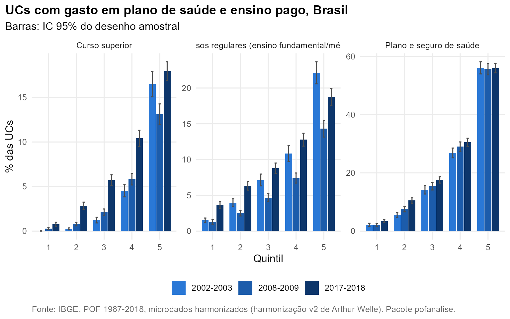

# Saúde e educação

**Pergunta.** Quem gasta do próprio bolso com saúde e educação, e
quanto?

**Método.** Participação no consumo sem aluguel por quintil (RMs, cinco
edições) e prevalência de gasto, com IC de 95%, no Brasil de 2002 em
diante. Folhas: remédios (22101), plano e seguro de saúde (22301),
cursos regulares (23101) e curso superior (23102). Em 1987-1988 não
existe a folha de cursos regulares, o que torna a educação daquela
edição incompleta.

## Saúde

A assistência à saúde pesa 8,2% no consumo do 1º quintil e 11,6% no do
5º em 2017-2018, mas com composições opostas. Remédios pesam 6,5% no 1º
quintil e 3,3% no 5º; plano de saúde, 0,7% e 5,9%. No Brasil, têm gasto
com plano de saúde 3,4% (IC 95%: 2,9 a 4,0) das UCs do 1º quintil e
55,9% (IC 95%: 54,4 a 57,5) das do 5º.

## Educação

A participação da educação cresce com o consumo: 3,3% no 1º quintil e
8,5% no 5º em 2017-2018. O curso superior pago é o item que mais se
espalhou: a proporção de UCs com esse gasto no 3º quintil vai de 1,2%
(IC 95%: 0,9 a 1,6) em 2002-2003 para 5,7% (IC 95%: 5,1 a 6,3) em
2017-2018. O período coincide com a expansão do ensino superior privado
e do financiamento estudantil; esta análise descreve, não identifica
causa.



| Nome | Quintil | 2002-2003 | 2008-2009 | 2017-2018 |
|:---|---:|:---|:---|:---|
| Curso superior | 1 | 0,0 \[-0,0; 0,0\] | 0,3 \[0,1; 0,4\] | 0,8 \[0,5; 1,0\] |
| Curso superior | 2 | 0,2 \[0,1; 0,4\] | 0,8 \[0,6; 1,0\] | 2,8 \[2,4; 3,2\] |
| Curso superior | 3 | 1,2 \[0,9; 1,6\] | 2,1 \[1,7; 2,5\] | 5,7 \[5,1; 6,3\] |
| Curso superior | 4 | 4,5 \[3,8; 5,2\] | 5,8 \[5,2; 6,5\] | 10,4 \[9,5; 11,3\] |
| Curso superior | 5 | 16,5 \[15,1; 17,9\] | 13,1 \[11,9; 14,3\] | 18,0 \[16,9; 19,0\] |
| Cursos regulares (ensino fundamental/médio) | 1 | 1,5 \[1,2; 1,8\] | 1,3 \[1,0; 1,6\] | 3,6 \[3,2; 4,1\] |
| Cursos regulares (ensino fundamental/médio) | 2 | 4,0 \[3,4; 4,5\] | 2,5 \[2,1; 2,9\] | 6,3 \[5,7; 7,0\] |
| Cursos regulares (ensino fundamental/médio) | 3 | 7,1 \[6,3; 8,0\] | 4,7 \[4,1; 5,2\] | 8,8 \[8,1; 9,5\] |
| Cursos regulares (ensino fundamental/médio) | 4 | 10,8 \[9,7; 12,0\] | 7,4 \[6,7; 8,1\] | 12,8 \[11,9; 13,7\] |
| Cursos regulares (ensino fundamental/médio) | 5 | 22,1 \[20,6; 23,7\] | 14,3 \[13,1; 15,5\] | 18,7 \[17,5; 19,9\] |
| Plano e seguro de saúde | 1 | 2,2 \[1,6; 2,7\] | 2,1 \[1,6; 2,5\] | 3,4 \[2,9; 4,0\] |
| Plano e seguro de saúde | 2 | 5,6 \[4,7; 6,4\] | 7,5 \[6,6; 8,3\] | 10,5 \[9,6; 11,4\] |
| Plano e seguro de saúde | 3 | 14,2 \[12,7; 15,7\] | 15,4 \[14,1; 16,7\] | 17,6 \[16,5; 18,7\] |
| Plano e seguro de saúde | 4 | 26,8 \[25,2; 28,5\] | 29,0 \[27,4; 30,6\] | 30,5 \[29,1; 31,9\] |
| Plano e seguro de saúde | 5 | 56,0 \[54,0; 58,1\] | 55,6 \[53,7; 57,6\] | 55,9 \[54,4; 57,5\] |

Proporção de UCs com gasto, Brasil, IC 95% (%)

## Reproduzir

``` r
dados <- pof_carregar(c(2002, 2008, 2017), dir, itens = list(plano = "22301", superior = "23102"))
plot(pof_analisar(dados, "plano", por = "quintil"))
pof_diferenca(dados, "superior", por = "cor")
```
